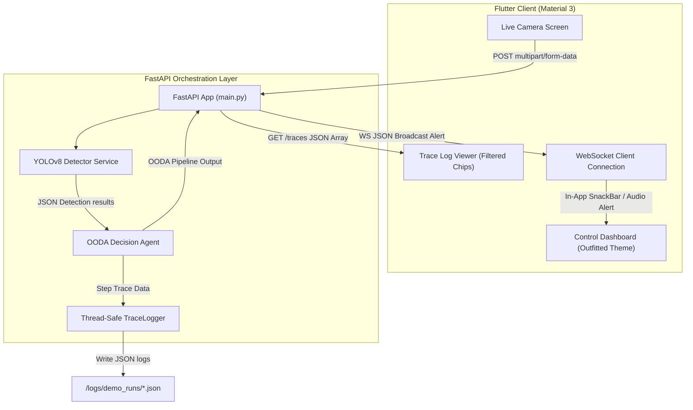

# Implementation Plan: CIRO Fire Crisis Response System

This document outlines the detailed architectural blueprint, core design decisions, API specifications, trace logging strategies, agent execution flows, and implementation timeline for the **CIRO Fire Crisis Response System (ciro_fire_orchestrator)**. 

Built as a **CIRO Hackathon 2026** project, the system combines real-time computer vision at the edge with stateful agent intelligence to automate and streamline crisis management for fire incidents.

---

## 1. Goal Description

The primary goal of the **Fire Crisis Response System** is to dramatically reduce response latency during structural or forest fires. By integrating real-time object detection (YOLOv8) with an agentic OODA-loop (Observe → Analyze → Decide → Act) reasoning system, the application bridges the gap between passive sensors/cameras and active response mobilization. 

The system operates as an end-to-end intelligent dispatch control room, automating detection verification, risk categorization, localized zone identification, instant notification dispatching via WebSockets, and closed-loop performance evaluation based on responder feedback.

---

## 2. Technical Architecture

The platform uses a highly decoupled, asynchronous client-server model to ensure sub-second response latency and high visual fidelity:



### Decoupled Pillars:
1. **Frontend (Flutter):** Built using Dart 3.x, featuring a premium dark-themed control room dashboard. Key highlights include non-symmetric layouts, custom gradient components (e.g., `fireAlertGradient`, `appBarGradient`), real-time WebSocket listeners, and interactive colored filter chips mapping to trace execution stages.
2. **Backend (FastAPI):** An asynchronous Python 3.10+ microservice layer offering dual-route execution pipelines (fully visual image uploading vs. structural JSON payload processing), WebSocket connection handling, and a high-performance trace logging pipeline.
3. **AI/ML (YOLOv8):** An edge-compatible object classification model trained to identify fire/smoke bounding boxes, with built-in seed-based deterministic mock fallback support to guarantee development and presentation consistency.

---

## 3. Tech Stack Decisions

| Technology | Selected For | Rationale & Trade-offs |
| :--- | :--- | :--- |
| **Flutter (Dart)** | Unified Frontend | Single-codebase compiling to Web, Mobile, and Desktop; native-speed rendering of Material 3 components; rich state management to handle asynchronous WebSocket alerts and stream updates smoothly. |
| **FastAPI (Python)** | Asynchronous Backend | High performance (approaching Node.js/Go speeds); native support for asynchronous event-driven routines; automatic OpenAPI/Swagger documentation generation; trivial integration with PyTorch/Ultralytics ML libraries. |
| **YOLOv8 (Ultralytics)** | Object Detection | State-of-the-art inference speeds suitable for real-time edge processing; compact weights (`best.pt`) that run efficiently on standard CPU or GPU environments. |
| **Local JSON + Firestore** | Database & Logs | Local-first JSON trace logging (`logs/demo_runs/`) ensures 100% offline capability and absolute zero network overhead for time-critical decision logging; Firestore provides cloud backup synchronization for multi-station deployment. |

---

## 4. API Endpoints

The FastAPI backend exposes the following key routes to coordinate between the client and the core agent pipeline:

### A. Health Check
* **Route:** `GET /health`
* **Purpose:** Quick operational checks for Docker, CI, and server deployment status.
* **Response:**
  ```json
  { "status": "ok" }
  ```

### B. Trace Log Retrieval
* **Route:** `GET /traces`
* **Purpose:** Reads, deserializes, and aggregates all chronological agent decision JSON logs from `logs/demo_runs/`, sorted in descending order (newest first).
* **Response:**
  ```json
  [
    {
      "agent_name": "DecisionAgent",
      "step_type": "ANALYZE",
      "reasoning": "Risk classified as 'high'...",
      "inputs": { ... },
      "output": { ... },
      "confidence_before": 0.58,
      "confidence_after": 0.63,
      "duration_ms": 12,
      "timestamp": "2026-05-17T22:30:15"
    }
  ]
  ```

### C. Live Bounding-Box Detection & Decision Pipeline
* **Route:** `POST /detect`
* **Format:** `multipart/form-data` containing `file: UploadFile`
* **Process Flow:**
  1. Accepts image upload (JPEG, PNG, WEBP, BMP, TIFF).
  2. Runs image through `yolo_detector.py` (falls back to deterministic, repeatable filename-hash-based mock detection if weights are not local).
  3. Automatically passes detection bounding boxes, labels, and confidence thresholds directly into `DecisionAgent.run_pipeline()`.
  4. Triggers the OODA loop (Observe → Analyze → Decide → Act), saving traces on disk.
  5. Broadcasts real-time action alerts over active WebSocket channels for high-priority dispatch commands (e.g., `EVACUATE`).
* **Response:** Combined object detection payload and step-by-step agent decisions.

### D. Isolated Decision Pipeline (Mock Testing & Simulation)
* **Route:** `POST /detect/decision`
* **Format:** `application/json` (Pydantic model `DetectionResults`)
* **Process Flow:**
  1. Accepts pre-computed bounding boxes and detection confidence values in the request body.
  2. Runs only the OODA decision agent pipeline, bypassing the heavy visual YOLO inference.
  3. Extremely useful for integration testing, automated unit tests, offline simulators, and replay runs.

### E. Real-time Notification WebSocket
* **Route:** `WS /ws`
* **Purpose:** Bi-directional active channel connection allowing the backend to instantly broadcast crisis commands (`DISPATCH_EVACUATE`, `DISPATCH_WARNING`) to all open dashboards in under 5 milliseconds.

---

## 5. Trace Logging Strategy

Trace logging is a foundational requirement of the CIRO Hackathon framework, ensuring 100% transparency of AI agent decisions.

### A. The Thread-Safe `TraceLogger`
The backend leverages a centralized `TraceLogger` class located at `backend/services/trace_logger.py`:
* **Chronological Bundling:** Writes separate JSON files named `traces_YYYYMMDD_HHMMSS.json` to organize runs.
* **Windows Compatibility:** Sanitizes ISO timestamps, converting colons (`:`) to hyphens (`-`) to guarantee crash-free IO operations on Windows filesystems.
* **Concurrency Protection:** Leverages Python filesystem checking to safely load, append, and rewrite trace logs sequentially, avoiding data corruption under concurrent API requests.

### B. Standard Trace Fields
Every log entry strictly captures:
* `agent_name` (e.g., `"DecisionAgent"`)
* `step_type` (e.g., `"OBSERVE"`, `"ANALYZE"`, `"DECIDE"`, `"ACT"`, `"EVALUATE"`)
* `reasoning` (human-readable string detailing the exact rationale used)
* `inputs` (the exact data parameters ingested during the step)
* `output` (the structured data dict outputted by the step)
* `confidence_before` (internal confidence score prior to running the step)
* `confidence_after` (internal confidence score after running the step)
* `tool_calls` (list of internal/external APIs invoked, e.g., `"FrontendDispatch"`)
* `duration_ms` (exact execution latency in milliseconds)
* `timestamp` (session ISO timestamp)

---

## 6. Agent Flow (OODA Loop)

The system utilizes a stateful OODA-loop design inside `DecisionAgent`, which manages an evolving internal confidence state ($0.0 \rightarrow 1.0$) representing its operational certainty.

```
                  ┌────────────────────────┐
                  │    YOLO Detection      │
                  └───────────┬────────────┘
                              │
                              ▼
                  ┌────────────────────────┐
                  │  OBSERVE (State update)│
                  └───────────┬────────────┘
                              │
                              ▼
                  ┌────────────────────────┐
                  │  ANALYZE (Zone mapping)│
                  └───────────┬────────────┘
                              │
                              ▼
                  ┌────────────────────────┐
                  │  DECIDE (Action select)│
                  └───────────┬────────────┘
                              │
                              ▼
                  ┌────────────────────────┐
                  │  ACT (Dispatch payload)│
                  └───────────┬────────────┘
                              │
            ┌─────────────────┴─────────────────┐
            ▼                                   ▼
┌────────────────────────┐          ┌────────────────────────┐
│ EVALUATE (Confirmed)   │          │ EVALUATE (False Alarm) │
│  Reinforce (+10%)      │          │  Penalize (-15%)       │
└────────────────────────┘          └────────────────────────┘
```

### Stage Breakdown:

#### 1. OBSERVE
* **Action:** Ingests raw YOLO outputs (coordinates, class scores, detected classes).
* **State Impact:** Adjusts internal confidence prior. If a fire/smoke instance is confirmed, confidence nudges upward (up to $+30\%$ of the detection score). If clean, confidence nudges downward ($-5\%$).
* **Output:** Initial situation summary listing active boxes and target classes.

#### 2. ANALYZE
* **Action:** Maps raw $x/y$ coordinates to logical architectural coordinates (e.g., `"Zone A (North Wing)"`, `"Zone E (Central Hub)"`). Establishes a raw risk band (`"low"`, `"medium"`, `"high"`) based on confidence thresholds and box count.
* **State Impact:** Adjusts confidence based on threat severity. High risk increases certainty ($+5\%$); low risk decreases it ($-3\%$).
* **Output:** Risk assessment profile and list of endangered building zones.

#### 3. DECIDE
* **Action:** Maps threat levels to action verbs:
  * High Risk $\rightarrow$ `EVACUATE` (Priority 1)
  * Medium Risk $\rightarrow$ `WARNING` (Priority 2)
  * Low Risk $\rightarrow$ `MONITOR` (Priority 3)
* **State Impact:** Committing to a decision reduces overall operational entropy ($+2\%$ certainty boost).
* **Output:** Formal dispatch action recommendation.

#### 4. ACT
* **Action:** Packages decisions into structural JSON command payloads. Sets the final alert messages to display in the Flutter client.
* **State Impact:** None (Action dispatched).
* **Output:** Structured command event dispatched over WebSockets/REST (`"DISPATCH_EVACUATE"`, `"DISPATCH_WARNING"`, etc.).

#### 5. EVALUATE (Closed-Loop)
* **Action:** Accepts secondary telemetry or manual feedback from responding emergency services.
* **State Impact:** High-stakes calibration. A verified alert reinforces confidence ($+10\%$); a registered false alarm heavily penalizes confidence ($-15\%$) to adjust agent sensitivity.
* **Output:** Step evaluation verdict (`CORRECT`, `FALSE_POSITIVE`, `AMBIGUOUS`).

---

## 7. Timeline for Completion

The system progress is tracked across six development phases, leveraging rapid prototyping.

```mermaid
gantt
    title CIRO Fire Crisis Response Timeline
    dateFormat  YYYY-MM-DD
    section Backend Setup
    Phase 1: Project Scaffolding & Setup    :done, p1, 2026-05-10, 2026-05-12
    Phase 2: Services & API Routing        :done, p2, 2026-05-12, 2026-05-14
    section Agent & ML
    Phase 3: YOLO & Decision Agent Core    :done, p3, 2026-05-14, 2026-05-16
    Phase 4: Real-time WebSockets & Alerts :done, p4, 2026-05-16, 2026-05-17
    section Frontend & Polish
    Phase 5: High-Fidelity UI Screens     :active, p5, 2026-05-17, 2026-05-18
    Phase 6: Integration Testing & Demos   :active, p6, 2026-05-18, 2026-05-19
```

* **Phase 1: Project Scaffolding & Setup (COMPLETED)**
  * Basic folder structures for both Flutter (`app/`) and FastAPI (`backend/`).
  * Dependency installation and configuration.

* **Phase 2: Services & API Routing (COMPLETED)**
  * Core `TraceLogger` system implementation.
  * Baseline FastAPI servers, CORS configurations, and `/health` endpoints.

* **Phase 3: YOLO & Decision Agent Core (COMPLETED)**
  * `yolo_detector.py` service integration with CPU/GPU dynamic detection.
  * Complete 5-stage OODA implementation inside `DecisionAgent`.
  * `/detect` and `/detect/decision` endpoints finalized.

* **Phase 4: Real-time WebSockets & Alerts (COMPLETED)**
  * FastAPI `/ws` broadcast routing.
  * Alert notification services, SnackBar dispatchers, and live simulator components.

* **Phase 5: High-Fidelity UI Screens (ACTIVE)**
  * Material 3 dark-themed control room screens.
  * Dynamic trace logging board featuring color-coded chips (cyan, purple, yellow, green, crimson) and smooth animations.

* **Phase 6: Integration Testing & Demos (ACTIVE)**
  * Full end-to-end integration verification (Uploading → Detecting → OODA Dispatch → WebSocket Alert → Trace Logging).
  * Demo runs and log exports to `logs/demo_runs/`.

---

## 8. User Review Required

Before proceeding with final integration testing, the following items require attention:

> [!IMPORTANT]
> **Mock vs. Active GPU Inference Fallback:**
> Ensure that standard laptop hardware runs utilizing the deterministic seed-based mock detection, keeping performance fluid. If a CUDA-compatible Nvidia GPU is present, YOLOv8 will automatically run active ML inference.

> [!WARNING]
> **Websocket Network Bindings:**
> In local simulation environments, Flutter clients must point their WebSocket base URL to `ws://localhost:8000/ws` or the machine's local IP address if running on physical mobile devices.

> [!NOTE]
> **Confidence Initialization:**
> The `DecisionAgent` is initialized with a neutral confidence score of `0.5` at system boot. This prior naturally adjusts as positive detections, false alarms, or system outcomes are recorded.

---

## 9. Verification Plan

### Automated Verification
Run the FastAPI server and execute localized backend tests:
```powershell
# Start the FastAPI server locally
uvicorn main:app --reload

# Test endpoints via PowerShell or Postman
Invoke-RestMethod -Uri "http://localhost:8000/health" -Method Get
Invoke-RestMethod -Uri "http://localhost:8000/traces" -Method Get
```

### Manual Verification
1. Open the Flutter application and navigate to the **Live Camera Screen**.
2. Snap or upload an image containing a simulated fire incident.
3. Verify that:
   * Bounding box overlay renders correctly.
   * A WebSocket SnackBar notification (`DISPATCH_EVACUATE` or `DISPATCH_WARNING`) triggers at the top of the dashboard.
   * A new, detailed trace card appears at the top of the **Trace Logs Screen** featuring matching OODA metrics.
