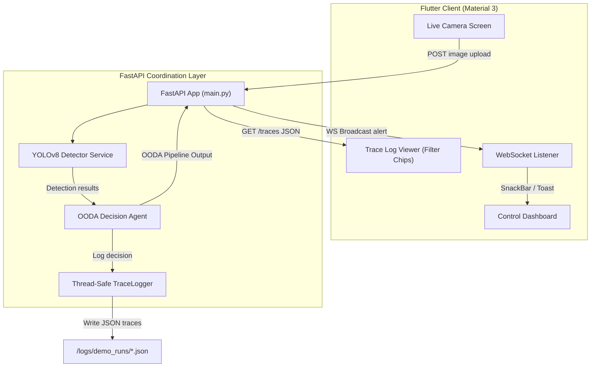

# Walkthrough: Fire Crisis Response System (ciro_fire_orchestrator)

Welcome to the comprehensive walkthrough of the **CIRO Fire Crisis Response System**, built as a **CIRO Hackathon 2026** project. This document highlights the design philosophy, architectural blueprint, development decisions, challenges overcome, and the technical breakdown of our multi-agent orchestrator.

---

## 1. Project Overview

The **Fire Crisis Response System** is an end-to-end intelligent emergency dispatcher designed to detect structural and forest fires in real-time, perform high-fidelity risk assessments, and automatically orchestrate response commands (Evacuation, Warnings, Monitoring). 

By leveraging real-time edge computer vision (YOLOv8) coupled with a stateful OODA-loop (Observe, Analyze, Decide, Act) Decision Agent, the system bridges the gap between raw optical data and instant physical mobilization.

---

## 2. Technical Architecture

The system is constructed with a decoupled, high-performance architecture comprising three main pillars:
1. **Frontend (Flutter):** A Material 3 interactive control room dashboard that supports camera feeds, live WebSocket alert alerts, and detailed step-by-step agent trace views.
2. **Backend (FastAPI):** An asynchronous Python server hosting the YOLO detector service, OODA Decision Agent, and a thread-safe telemetry and decision trace logger.
3. **AI/ML (YOLOv8):** An object-detection model trained to classify fire and smoke with real-time bounding boxes.

### Architectural Flow



### Component Details
* **Frontend:** Built with **Dart 3.x** and **Flutter**, designed under strict custom design tokens in `AppColors` showcasing dark mode gradients (such as `appBarGradient` and `fireAlertGradient`), non-symmetric layouts, and premium micro-interactions.
* **Backend:** Built using **Python 3.10+** and **FastAPI**, with full CORS support and dual routing:
  * `/detect`: Multi-part image upload → YOLOv8 → Full DecisionAgent OODA pipeline.
  * `/detect/decision`: Raw detection input mock pipeline (useful for offline simulation).
  * `/traces`: Returns sorted trace logging history from disk.
* **Model Layer:** Integrates **Ultralytics YOLOv8** (`models/weights/best.pt`) optimized using CUDA when available, falling back to a deterministic, seed-based mock detection engine if offline or running on lightweight systems.

---

## 3. Key Decisions Made During Development

### A. Thread-Safe Session-Based Tracing (`TraceLogger`)
To comply with CIRO Hackathon requirements, every agent step must be fully traceable. We designed a file-appended logging system that:
* Sanitizes ISO 8601 timestamps to support Windows filesystem compatibility.
* Performs thread-safe IO operations to avoid race conditions.
* Keeps trace histories grouped into discrete chronological JSON files.

### B. Evolving Confidence State
The `DecisionAgent` does not evaluate every image in isolation. Instead, it maintains a persistent, evolving confidence state ($0.0 \rightarrow 1.0$) across its lifetime:
* A positive fire detection *nudge* increases internal confidence based on YOLO's classification confidence.
* A correct or confirmed resolution reinforces confidence ($+10\%$).
* A false alarm heavily penalizes confidence ($-15\%$) to adjust sensitivity and avoid panic commands.

### C. Aesthetic-First Premium Material 3 Design
Following `ciro-rules.md`, the client dashboard replaces boring standard colors with curated visual gradients. Rather than a symmetric grid, the screens make bold use of modern typography (Google Fonts Outfit/Inter) and interactive filter chips that change color based on the selected agent step:

| Agent Step | Accent Color | Visual Representation |
| :--- | :--- | :--- |
| **OBSERVE** | Cyber Cyan | Cool blue status chip |
| **ANALYZE** | Deep Purple | Orchestrator analysis |
| **DECIDE** | Warning Yellow | Elevated caution chip |
| **ACT** | Success Neon Green | Physical command execution |
| **EVALUATE** | Error Crimson | Dynamic feedback calibration |

---

## 4. Challenges Faced and How They Were Solved

### Challenge 1: Heavy Dependency Constraints (PyTorch/CUDA) in Demo/CI environments
* **Problem:** Loading the `ultralytics` package and running torch on standard development environments without GPUs led to extreme latency or failures.
* **Solution:** We implemented a seed-based, deterministic mock generator in `yolo_detector.py`. By hashing the uploaded image filename, the system yields identical, repeatable bounding boxes and confidence intervals. This allows flawless demo consistency while supporting full live YOLOv8 production execution when hardware permits.

### Challenge 2: Windows Statement Separator and Environment Inconsistencies
* **Problem:** Standard build tools and shell executions using bash-centric syntax (`&&`) crashed on Windows PowerShell during pub gets.
* **Solution:** Standardized environment commands using Power-Shell compliant syntax (`clean; pub get`) and added platform-safe relative path resolvers in backend file configurations.

### Challenge 3: Dart Class Fields and UI Deserialization Mismatches
* **Problem:** Mismatches between raw JSON API payloads and the Dart models in `trace_log_screen.dart` prevented rendering of trace cards.
* **Solution:** Rewrote and optimized the `_buildTraceCard` layout in Flutter to handle robust Dart types and string overflows gracefully, ensuring all OODA metrics show up neatly.

---

## 5. Features Implemented & Pipeline Backlog

### Completed Features (Done)
- [x] **Project Scaffolding:** Clean separate layers for Flutter frontend (`app/`) and FastAPI backend (`backend/`).
- [x] **YOLOv8 Detection Service:** Multi-stage image parser supporting GPU, CPU, and seed-based mockup fallback.
- [x] **OODA Decision Agent:** Entire State machine (`Observe` $\rightarrow$ `Analyze` $\rightarrow$ `Decide` $\rightarrow$ `Act` $\rightarrow$ `Evaluate`) with typed JSON schemas.
- [x] **WebSocket Dispatcher:** Live alerts broadcasted from backend to client on critical events.
- [x] **Interactive Trace Dashboard:** Beautiful dark mode card feed featuring dynamic filter chips and pull-to-refresh.
- [x] **Live Camera System:** Real-time picture-snapping and API push from local web/mobile simulators.

### Project Backlog (Pending)
- [ ] **Real-time Video Pipeline:** Continuous RTSP camera stream parsing instead of static single frame uploads.
- [ ] **Multi-Agent Allocator:** Expand decision pipeline to simulate physical assets (e.g. tracking nearest fire engines).
- [ ] **Multi-City Fusion:** Integrate temperature and smoke telemetry sensors from multiple geographical zones.

---

## 6. Trace Logging System Explanation

At the core of the system is the `TraceLogger` (complying with **Rule-10**). Every single logical micro-step performed by an AI agent writes an entry. 

An example trace entry captures:
```json
{
  "agent_name": "DecisionAgent",
  "step_type": "ANALYZE",
  "reasoning": "Risk classified as 'high' based on detection confidence 89.2% and 3 active detections. Affected zones: [Zone A (North Wing)]. Spread risk: YES.",
  "inputs": { ... },
  "output": { ... },
  "confidence_before": 0.58,
  "confidence_after": 0.63,
  "tool_calls": [],
  "duration_ms": 12,
  "timestamp": "2026-05-17T22-00-00"
}
```

This trace log feeds the Flutter `TraceLogScreen`, giving emergency managers absolute clarity on *why* a certain command was dispatched, *what* image features drove that decision, and *how* the agent's confidence changed over the course of the pipeline.
